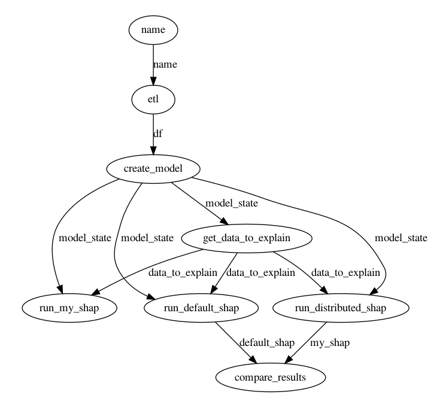

# My KernelSHAP implementation

This code implements the KernelSHAP algorithm as described in this [paper](https://arxiv.org/pdf/1705.07874.pdf) 

The Python [shap library](https://github.com/slundberg/shap) already provides an implementation of KernelSHAP, but the implementation is very complex and difficult to understand. My implementation is much shorter and easier to understand. 

For a detailed write up about how Kernel SHAP works, see this [blog post](https://www.telesens.co/2020/09/17/kernel-shap/)

## Prefect + DASK based distributed implementation
I also provide a distributed implementation that uses Python multiprocessing library to distribute out the Shap value computation for multiple data points across multiple processes. I use a RandomForest model trained on the winequality-red dataset to show that the Shap values computed by my implementation matches the default Python implementation exactly.

I use the Prefect workflow orchestration system running over a local DASK cluster to run the ETL task, my serial KernelSHAP implementation, my distributed KernelSHAP implementation, the default Python Shap library implementation and a results comparison tasks. The three KernelSHAP variants are executed in parallel, as shown in the table below.

Total flow execution time (sec) | Distributed implementation | Serial implementation | Default Python implementation 
--- | --- | --- | ---
47.8 | 6.9 | 31.4 | 41.8

To run the code, simply run kernel_shap_test.py from a debugger or command line. No arguments are necessary. You'll have to install DASK, shap package, sklearn and other required libraries if you don't already have them. 

Here's how the Prefect flow looks like:

## Distributed implementation using ray
I recently learnt about [Ray](https://docs.ray.io/en/master/ray-overview/index.html), another system for building distributed applications. To use Ray, run `kernel_shap_distributed_ray.py `. This will initialize a Ray cluster on your computer (with 6 workers by default) and run the DAG shown above on this cluster. See [this](https://telesens.co/2020/10/05/speeding-up-shapley-value-computation-using-ray-a-distributed-computing-system/) post for more advanced configuration options, such as connecting to an existing Ray cluster.